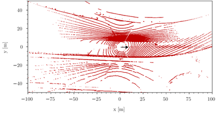
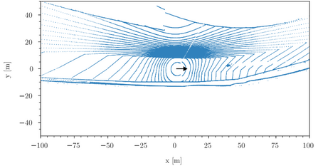
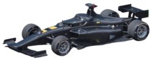
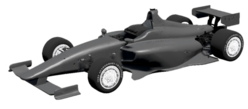

# Sim-to-Real Distribution-Aligned Dataset (S2R-DAD)

This repository contains the dataset and a description of the data and labels used in [Quantifying the LiDAR Sim-to-Real Domain Shift: A Detailed Investigation Using Object Detectors and Analyzing Point Clouds at Target-Level](https://link.to.paper).
The dataset includes 12,000 labeled point clouds in total, whereas 6,000 are captured during the [Indy
Autonomous Challenge](https://www.indyautonomouschallenge.com/) in Las Vegas in 2022. The other subset of 6,000 samples is generated in
simulation and includes the same scenarios, objects, and environment as the real counterpart.
Each point cloud file (.pcd) contains the fused point clouds of three LiDAR sensors, covering 360°
horizontally in total. The labels for each point cloud (.txt) are in the same format as the [labels of the
KITTI dataset](https://github.com/bostondiditeam/kitti/blob/master/resources/devkit_object/readme.txt).

As this dataset is distribution-aligned, i.e., every real point cloud has a scenario-identical simulated counterpart with the same indx, this dataset can be used to study the domain shift or evaluate the performance of domain adaptation algorithms. 



Examples of a real (red) and sim (blue) point cloud showing the same scenario from our dataset.

## Dataset
Please follow this [link](https://mediatum.ub.tum.de/1695833?id=1695833&change_language=en) to download the dataset (~12GB).

## Dataset structure
The dataset contains two main folders, real and sim, that are equally structured. Each contains a subdirectory *data* and *ImageSets*. *data* contains 6,000 point clouds in the .pcd format and 6,000 labels with the corresponding index in the .txt format similar to the [KITTI label format](https://github.com/bostondiditeam/kitti/blob/master/resources/devkit_object/readme.txt). *ImageSet* contains three .txt files, train.txt, val.txt, and test.txt, listing the indices of the point clouds used for training, validation, and testing. Our split is 4000, 1000, 1000 for training, validation, and testing, respectively.  
```
Sim2RealDistributionAlignedDataset
├── real
│   ├── data
│   │   │── pcl
│   │   │   │── 000000.pcd
│   │   │   │── ...
│   │   │   │── 029995.pcd
│   │   │── label
│   │   │   │── 000000.txt
│   │   │   │── ...
│   │   │   │── 029995.txt
│   ├── ImageSets
│   │   │── train.txt
│   │   │── val.txt
│   │   │── test.txt
├── sim
│   ├── data
│   │   │── pcl
│   │   │   │── 000000.pcd
│   │   │   │── ...
│   │   │   │── 029995.pcd
│   │   │── label
│   │   │   │── 000000.txt
│   │   │   │── ...
│   │   │   │── 029995.txt
│   ├── ImageSets
│   │   │── train.txt
│   │   │── val.txt
│   │   │── test.txt

```

## Data description
Please check our paper for a detailed data description. The following provides a brief summary of the real and sim data. 

### Real dataset
The real dataset was captured during  the [Indy Autonomous Challenge](https://www.indyautonomouschallenge.com/) in Las Vegas in 2022. The vehicle used for data generation was an autonomous AV-21 equipped with three LiDAR sensors, each covering 120° horizontally to cover 360° in total. The .pcd files include the fused point clouds. Labeling was done semi-automatically using the GPS positions of the ego-vehicle and the other vehicles on track. The positions were refined using the point cloud distribution in the proximity of the initially placed 3D bounding boxes. 

### Sim dataset
The sim dataset is distribution-aligned, i.e., scenario-identical, with the real dataset. It was created using Unity and a custom LiDAR sensor model. The environment models the same racetrack as in the real data. The scenarios extracted from the real dataset were replayed in this simulation environment and point clouds were captured using the custom LiDAR sensor model. The labels were generated automatically in Unity.  



Real (left) and sim (right) AV21 used for dataset generation


## Citation
If you find our work useful in your research, please consider citing:

    @misc{Huch_S2R_DAD_2023, 
        author = {Huch, Sebastian and  Scalerandi, Luca and  Rivera, Esteban and  Lienkamp, Markus},
        title = {S2R-DAD: Sim-to-Real Distribution-Aligned Dataset},
        publisher = {Technical University of Munich},
        url = {https://mediatum.ub.tum.de/1695833},
        type = {Dataset},
        year = {2023},
        doi = {10.14459/2023mp1695833},
        keywords = {Sim-to-Real; LiDAR; Point Cloud; Domain Shift; Domain Adaptation},
        language = {en},
    }

Part of this dataset was captured during the Indy Autonomous Challenge. Please consider citing the work of TUM Autonomous Motorsport as well:  

    @article{Betz_2023,
        doi = {10.1002/rob.22153},
        url = {https://doi.org/10.1002%2Frob.22153},
        year = 2023,
        month = {jan},
        publisher = {Wiley},
        author = {Johannes Betz and Tobias Betz and Felix Fent and Maximilian Geisslinger and Alexander Heilmeier and Leonhard Hermansdorfer and Thomas Herrmann and Sebastian Huch and Phillip Karle and Markus Lienkamp and Boris Lohmann and Felix Nobis and Levent Ögretmen and Matthias Rowold and Florian Sauerbeck and Tim Stahl and Rainer Trauth and Frederik Werner and Alexander Wischnewski},
        title = {{TUM} autonomous motorsport: An autonomous racing software for the Indy Autonomous Challenge},
        journal = {Journal of Field Robotics}
    }